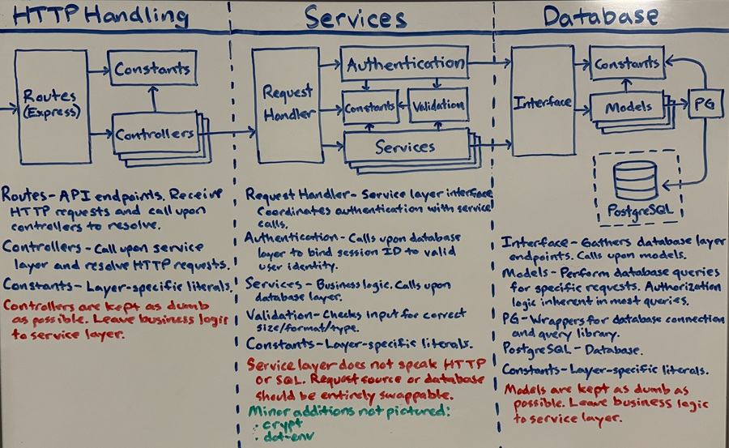
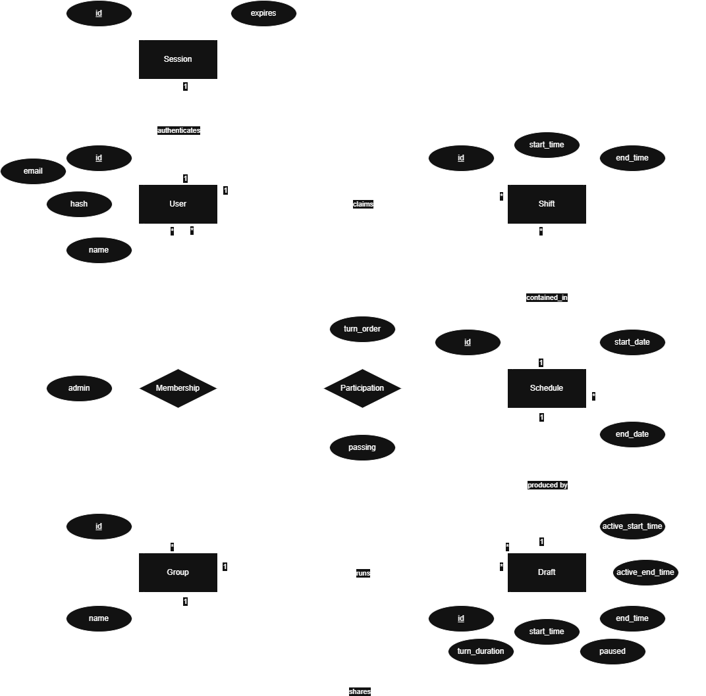
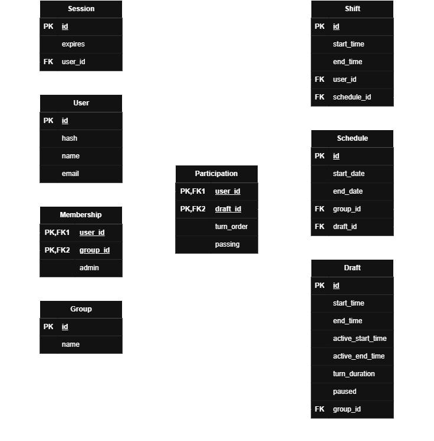

# Architecture Specification

The backend architecture is divided into three broad layers: *HTTP handling*, *services*, and the *database*.

HTTP handling is performed using Express routes to call upon controllers that interact with the service layer and resolve HTTP requests. Controllers are kept as dumb as possible so that business logic is not being performed in this layer.

The service layer contains all business logic, including authentication and app request processing. The service layer does not speak HTTP and could conceivably be attached to an entirely different protocol handler if desired. Similarly, the service layer does not speak PG or SQL. Instead, it calls upon the database layer to persist and retrieve data.

The database layer encapsulates direct queries to the PostgreSQL database. Queries are performed by database models with direct knowledge of the database schema. Models are kept as dumb as possible so that business logic is not performed in this layer. However, some authorization logic is inherent in the design of certain queries, and this is an acceptable tradeoff.

## Component Diagram

Simple dependency arrows are used instead of UML "lollipops" for cleaner visual organization.

## Database

### ER Diagram

### Schema

---

[Back to README](../README.md)
